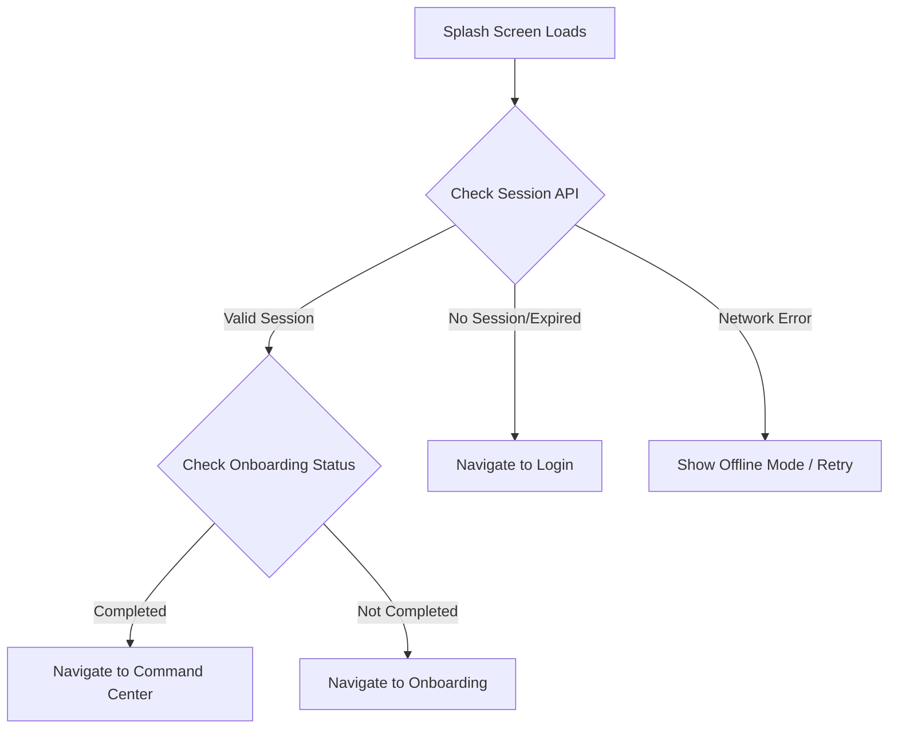

# Splash Screen - API Documentation

## Screen Overview
**File**: `lib/screens/splash/splash_screen.dart`
**Purpose**: Initial loading screen with branding and auto-navigation
**Duration**: 2 seconds
**Navigation**: Auto-redirects to Onboarding (first launch) or Login/Home (returning user)

## Screen Components
- ORIN logo with Orbitron font (48px, letter-spacing: 8)
- Tagline: "Your visual intelligence partner"
- Fade animation (1200ms)
- Background gradient

---

## API Requirements

### 1. Check User Authentication Status
**Endpoint**: `GET /api/v1/auth/check-session`
**Timing**: Called immediately on splash screen mount
**Purpose**: Determine if user has valid session to skip login

#### Request
```http
GET /api/v1/auth/check-session
Headers:
  Authorization: Bearer <stored_token>
  Device-ID: <unique_device_identifier>
  App-Version: 1.0.0
```

#### Response - Success (200)
```json
{
  "success": true,
  "data": {
    "isAuthenticated": true,
    "userId": "usr_abc123xyz",
    "sessionExpiresAt": "2025-12-31T23:59:59Z",
    "refreshToken": "refresh_token_xyz",
    "user": {
      "id": "usr_abc123xyz",
      "email": "user@example.com",
      "firstName": "John",
      "lastName": "Doe",
      "profilePictureUrl": "https://cdn.orin.app/avatars/usr_abc123xyz.jpg",
      "role": "owner"
    }
  }
}
```

#### Response - Not Authenticated (401)
```json
{
  "success": false,
  "error": {
    "code": "SESSION_EXPIRED",
    "message": "Session has expired. Please login again."
  }
}
```

#### Response - First Time User (404)
```json
{
  "success": false,
  "error": {
    "code": "NO_SESSION",
    "message": "No active session found."
  }
}
```

---

### 2. Check Onboarding Status
**Endpoint**: `GET /api/v1/user/onboarding-status`
**Timing**: Called if session is valid
**Purpose**: Determine if user has completed onboarding

#### Request
```http
GET /api/v1/user/onboarding-status
Headers:
  Authorization: Bearer <access_token>
```

#### Response - Success (200)
```json
{
  "success": true,
  "data": {
    "hasCompletedOnboarding": true,
    "completedAt": "2025-01-15T10:30:00Z",
    "skippedOnboarding": false
  }
}
```

---

### 3. Get App Configuration
**Endpoint**: `GET /api/v1/config/app`
**Timing**: Background call during splash screen
**Purpose**: Fetch app-level configuration, feature flags, and remote settings

#### Request
```http
GET /api/v1/config/app
Headers:
  App-Version: 1.0.0
  Platform: android | ios
```

#### Response - Success (200)
```json
{
  "success": true,
  "data": {
    "minSupportedVersion": "1.0.0",
    "latestVersion": "1.2.0",
    "forceUpdate": false,
    "updateUrl": "https://orin.app/download",
    "features": {
      "aiChatEnabled": true,
      "videoDownloadEnabled": true,
      "multiUserEnabled": true,
      "darkModeEnabled": true
    },
    "apiBaseUrl": "https://api.orin.app",
    "streamBaseUrl": "https://stream.orin.app",
    "cdnBaseUrl": "https://cdn.orin.app",
    "maintenanceMode": false,
    "maintenanceMessage": null
  }
}
```

---

## Navigation Logic Flow



---

## Local Storage Requirements

### Data to Store Locally
1. **Access Token** - For authenticated API calls
2. **Refresh Token** - For token refresh
3. **User ID** - Quick access to user identifier
4. **Onboarding Status** - Cache to reduce API calls
5. **Device ID** - Unique device identifier
6. **Last Sync Timestamp** - Track last successful sync

### Storage Keys (SharedPreferences/SecureStorage)
```dart
const String KEY_ACCESS_TOKEN = 'access_token';
const String KEY_REFRESH_TOKEN = 'refresh_token';
const String KEY_USER_ID = 'user_id';
const String KEY_ONBOARDING_COMPLETED = 'onboarding_completed';
const String KEY_DEVICE_ID = 'device_id';
const String KEY_LAST_SYNC = 'last_sync_timestamp';
```

---

## Error Handling

### Network Errors
- **No Internet**: Cache check → Navigate to Login with offline indicator
- **Timeout**: Retry once → Navigate to Login
- **Server Error (5xx)**: Show error message → Navigate to Login after 3 seconds

### Token Errors
- **Token Expired**: Clear storage → Navigate to Login
- **Invalid Token**: Clear storage → Navigate to Login

---

## Security Considerations

1. **Token Storage**: Use `flutter_secure_storage` for tokens (encrypted storage)
2. **Device ID**: Generate on first install using UUID + device fingerprint
3. **SSL Pinning**: Implement certificate pinning for API calls
4. **Token Rotation**: Refresh token before expiry (background task)

---

## Performance Optimizations

1. **Parallel API Calls**: Make session check + config fetch in parallel
2. **Cache Strategy**: Cache onboarding status locally (TTL: 24 hours)
3. **Preload Assets**: Start loading Command Center assets during splash
4. **Timeout**: Set 5-second timeout for session check API

---

## API Call Sequence

```
1. [0ms]     Splash Screen Mounted
2. [0ms]     Start fade animation
3. [50ms]    GET /api/v1/auth/check-session (parallel)
4. [50ms]    GET /api/v1/config/app (parallel)
5. [300ms]   Session response received
6. [350ms]   Config response received
7. [2000ms]  Animation complete
8. [2000ms]  Navigate based on session status
```

---

## Analytics Events

Track the following events for analytics:

```dart
// Event 1: Splash Screen Viewed
{
  "event": "splash_screen_viewed",
  "timestamp": "2025-12-30T10:00:00Z",
  "deviceId": "device_abc123",
  "appVersion": "1.0.0"
}

// Event 2: Session Check Result
{
  "event": "session_check_completed",
  "result": "authenticated" | "not_authenticated" | "error",
  "duration_ms": 285
}

// Event 3: Navigation Decision
{
  "event": "splash_navigation",
  "destination": "command_center" | "login" | "onboarding",
  "reason": "valid_session" | "no_session" | "onboarding_incomplete"
}
```

---

## Dependencies

### Required Packages
- `http` or `dio` - HTTP client
- `flutter_secure_storage` - Secure token storage
- `shared_preferences` - Cache configuration
- `device_info_plus` - Device identification

---

## Testing Scenarios

1. **First Launch**: No session → Onboarding
2. **Logged In User**: Valid session → Command Center
3. **Expired Session**: Expired token → Login
4. **Incomplete Onboarding**: Valid session + incomplete onboarding → Onboarding
5. **Network Offline**: No internet → Login with retry option
6. **Server Maintenance**: 503 response → Show maintenance message
7. **Force Update**: minVersion > appVersion → Show update dialog

---

## Notes

- Splash screen is not an authenticated screen, but makes authenticated calls
- All API calls should have proper error handling
- Token refresh should happen silently in background if token is close to expiry
- Device ID should be persistent across app reinstalls if possible (use keychain/keystore)
