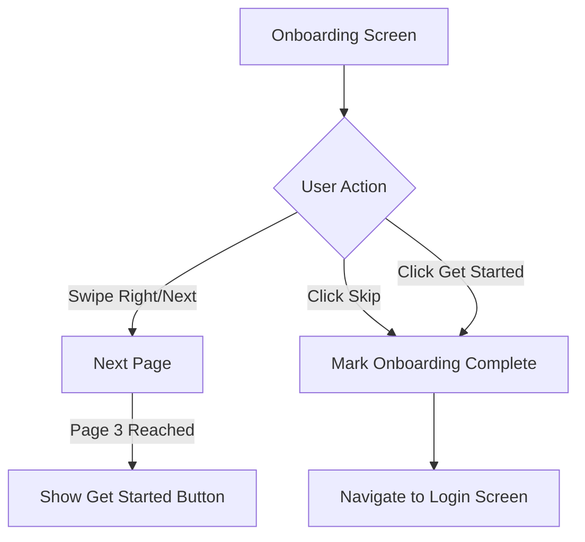

# Onboarding Screen - API Documentation

## Screen Overview
**File**: `lib/screens/onboarding/onboarding_screen.dart`
**Purpose**: Introduce new users to ORIN's key features with 3-page carousel
**Navigation**: Skip → Login | Get Started (page 3) → Login

## Screen Components

### Page 1: "Your cameras, watched for you"
- Image: `assets/images/onboarding_1.jpeg`
- Title: "Your cameras, watched for you"
- Subtitle: "AI guards monitor your spaces 24/7, so you don't have to"

### Page 2: "Smart alerts, not spam"
- Image: `assets/images/onboarding_2.jpeg`
- Title: "Smart alerts, not spam"
- Subtitle: "Get notified of important moments, not every single movement"

### Page 3: "Complete peace of mind"
- Image: `assets/images/onboarding_3.jpeg`
- Title: "Complete peace of mind"
- Subtitle: "Everything you need to feel secure, nothing you don't"

### UI Elements
- Page indicators (monochrome dots)
- Next button (pages 1-2)
- Get Started button (page 3)
- Skip button (top-right, all pages)

---

## API Requirements

### 1. Track Onboarding Progress
**Endpoint**: `POST /api/v1/user/onboarding/track`
**Timing**: Called on each page view and on skip/complete
**Purpose**: Analytics and feature optimization

#### Request - Page View
```http
POST /api/v1/user/onboarding/track
Headers:
  Device-ID: <unique_device_identifier>
  App-Version: 1.0.0
Content-Type: application/json

Body:
{
  "eventType": "page_viewed",
  "pageNumber": 1,
  "pageTitle": "Your cameras, watched for you",
  "timestamp": "2025-12-30T10:05:30Z",
  "deviceInfo": {
    "platform": "android",
    "osVersion": "14",
    "deviceModel": "Pixel 7"
  }
}
```

#### Request - Skip Onboarding
```http
POST /api/v1/user/onboarding/track
Content-Type: application/json

Body:
{
  "eventType": "skipped",
  "skippedAtPage": 2,
  "timestamp": "2025-12-30T10:05:45Z"
}
```

#### Request - Complete Onboarding
```http
POST /api/v1/user/onboarding/track
Content-Type: application/json

Body:
{
  "eventType": "completed",
  "completedAt": "2025-12-30T10:06:00Z",
  "totalTimeSpent": 30,
  "viewedAllPages": true
}
```

#### Response - Success (200)
```json
{
  "success": true,
  "message": "Onboarding event tracked successfully"
}
```

---

### 2. Mark Onboarding as Completed
**Endpoint**: `POST /api/v1/user/onboarding/complete`
**Timing**: Called when user clicks "Get Started" or "Skip"
**Purpose**: Update user profile to prevent showing onboarding again

#### Request
```http
POST /api/v1/user/onboarding/complete
Headers:
  Device-ID: <unique_device_identifier>
Content-Type: application/json

Body:
{
  "completedAt": "2025-12-30T10:06:00Z",
  "skipped": false,
  "source": "get_started_button"
}
```

#### Response - Success (200)
```json
{
  "success": true,
  "data": {
    "userId": "guest_device_abc123",
    "onboardingCompleted": true,
    "completedAt": "2025-12-30T10:06:00Z",
    "nextStep": "login"
  }
}
```

---

### 3. Prefetch Login Screen Assets (Optional)
**Endpoint**: `GET /api/v1/assets/prefetch`
**Timing**: Background call on page 3 (last page)
**Purpose**: Preload login screen assets for smooth transition

#### Request
```http
GET /api/v1/assets/prefetch?screen=login
Headers:
  Device-ID: <unique_device_identifier>
```

#### Response - Success (200)
```json
{
  "success": true,
  "data": {
    "assets": [
      {
        "type": "image",
        "url": "https://cdn.orin.app/assets/login-bg.jpg",
        "priority": "high"
      },
      {
        "type": "icon",
        "url": "https://cdn.orin.app/assets/orin-logo.svg",
        "priority": "high"
      }
    ]
  }
}
```

---

## Navigation Logic Flow



---

## Local Storage Requirements

### Data to Store Locally
1. **Onboarding Completed** - Boolean flag
2. **Onboarding Skipped** - Boolean flag
3. **Completion Timestamp** - ISO 8601 string
4. **Last Viewed Page** - Integer (1-3)

### Storage Keys (SharedPreferences)
```dart
const String KEY_ONBOARDING_COMPLETED = 'onboarding_completed';
const String KEY_ONBOARDING_SKIPPED = 'onboarding_skipped';
const String KEY_ONBOARDING_COMPLETED_AT = 'onboarding_completed_at';
const String KEY_ONBOARDING_LAST_PAGE = 'onboarding_last_page';
```

---

## Error Handling

### Network Errors
- **No Internet**: Store completion locally, sync when online
- **API Failure**: Gracefully fail, allow user to proceed to login
- **Timeout**: Log error, don't block user navigation

### Fallback Strategy
If API calls fail:
1. Store onboarding completion locally
2. Navigate to login screen
3. Retry syncing completion status on next app launch

---

## Analytics Events

Track the following events for product analytics:

```dart
// Event 1: Onboarding Started
{
  "event": "onboarding_started",
  "timestamp": "2025-12-30T10:05:00Z",
  "deviceId": "device_abc123",
  "source": "first_launch"
}

// Event 2: Page Viewed
{
  "event": "onboarding_page_viewed",
  "pageNumber": 1,
  "pageTitle": "Your cameras, watched for you",
  "timeOnPreviousPage": 5.2,
  "timestamp": "2025-12-30T10:05:05Z"
}

// Event 3: Page Swiped
{
  "event": "onboarding_page_swiped",
  "fromPage": 1,
  "toPage": 2,
  "direction": "left",
  "timestamp": "2025-12-30T10:05:10Z"
}

// Event 4: Skip Clicked
{
  "event": "onboarding_skipped",
  "skippedAtPage": 2,
  "totalPagesViewed": 2,
  "totalTimeSpent": 15.5,
  "timestamp": "2025-12-30T10:05:15Z"
}

// Event 5: Completed
{
  "event": "onboarding_completed",
  "completionMethod": "get_started_button",
  "viewedAllPages": true,
  "totalTimeSpent": 30.0,
  "timestamp": "2025-12-30T10:06:00Z"
}
```

---

## Performance Optimizations

1. **Image Preloading**: Load all 3 images on screen mount to prevent lag
2. **Lazy Analytics**: Batch analytics events and send on completion
3. **Non-Blocking APIs**: Don't wait for API responses before navigation
4. **Asset Caching**: Cache onboarding images locally for offline access

---

## API Call Sequence

```
1. [0ms]     Onboarding Screen Mounted
2. [0ms]     Preload all 3 images
3. [500ms]   POST /api/v1/user/onboarding/track (page_viewed: 1)
4. [5000ms]  User swipes to page 2
5. [5100ms]  POST /api/v1/user/onboarding/track (page_viewed: 2)
6. [10000ms] User clicks "Get Started"
7. [10100ms] POST /api/v1/user/onboarding/complete (async, non-blocking)
8. [10100ms] POST /api/v1/user/onboarding/track (completed)
9. [10100ms] Navigate to Login (don't wait for API response)
```

---

## Testing Scenarios

1. **First Time User**: Show onboarding → Complete → Login
2. **Skip on Page 1**: Click skip → Mark complete → Login
3. **Skip on Page 2**: Click skip → Mark complete → Login
4. **Complete All Pages**: View all 3 → Get Started → Login
5. **Offline Mode**: Complete onboarding → Store locally → Sync on next launch
6. **Network Failure**: API fails → Navigate to login anyway
7. **Back Button**: Prevent going back to splash screen
8. **Rapid Swiping**: Handle quick page changes without API spam

---

## Security Considerations

1. **No Authentication**: Onboarding is pre-auth, no tokens required
2. **Device Fingerprinting**: Use Device-ID for anonymous tracking
3. **Rate Limiting**: Prevent abuse of tracking API (max 10 events/minute)
4. **Data Privacy**: Don't collect PII during onboarding

---

## UI/UX Notes

- **Auto-advance**: Do NOT auto-advance pages (user control)
- **Swipe Gestures**: Support both swipe and button tap
- **Page Indicators**: Active dot is darker, inactive dots are lighter
- **Skip Visibility**: Always visible on all pages
- **Animation**: Smooth fade transition between pages (300ms)
- **Accessibility**: Support TalkBack/VoiceOver for screen readers

---

## Dependencies

### Required Packages
- `smooth_page_indicator` - Page dots
- `http` or `dio` - HTTP client
- `shared_preferences` - Local storage
- `cached_network_image` - Image caching (if images are remote)

---

## Notes

- Onboarding should only be shown once per device/user
- If user clears app data, onboarding will show again
- Backend should track onboarding completion rate for product analytics
- Consider A/B testing different onboarding content in the future
- Images are currently local assets (assets/images/onboarding_*.jpeg)
- No API calls are blocking - user can proceed even if network fails
