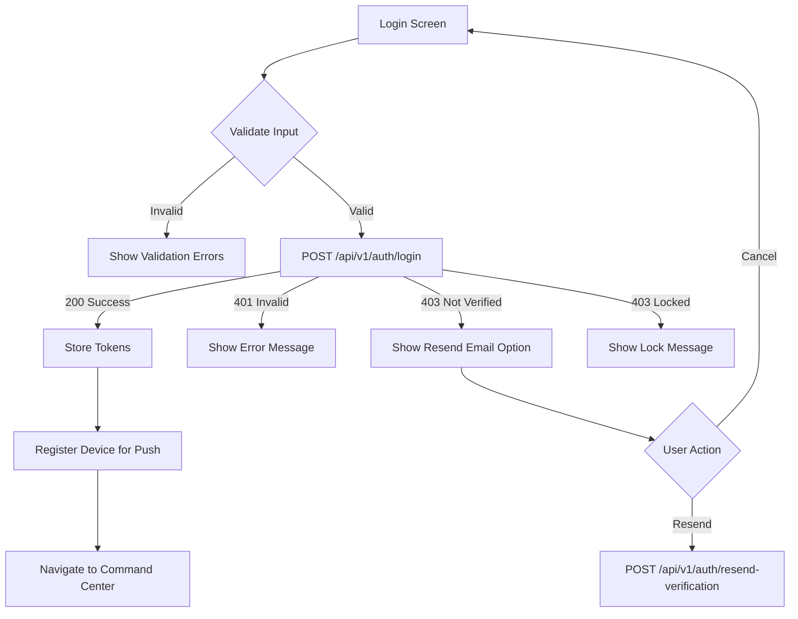

# Login Screen - API Documentation

## Screen Overview
**File**: `lib/screens/auth/login_screen.dart`
**Purpose**: Authenticate users with email and password
**Navigation**: Success → Command Center | Forgot Password → Password Reset Flow

## Screen Components
- ORIN logo (Orbitron font, bold, letter-spacing: 2)
- Email input field (text input with email keyboard)
- Password input field (obscured text with visibility toggle)
- Sign In button
- Forgot Password link
- Minimal, centered layout

---

## API Requirements

### 1. User Login (Email/Password)
**Endpoint**: `POST /api/v1/auth/login`
**Timing**: Called when user clicks "Sign In" button
**Purpose**: Authenticate user and return access tokens

#### Request
```http
POST /api/v1/auth/login
Headers:
  Content-Type: application/json
  Device-ID: <unique_device_identifier>
  App-Version: 1.0.0
  Platform: android | ios

Body:
{
  "email": "user@example.com",
  "password": "SecurePassword123!",
  "deviceInfo": {
    "deviceId": "device_abc123xyz",
    "deviceName": "John's iPhone",
    "platform": "ios",
    "osVersion": "17.2",
    "appVersion": "1.0.0",
    "fcmToken": "fcm_token_for_push_notifications"
  },
  "rememberMe": true
}
```

#### Response - Success (200)
```json
{
  "success": true,
  "data": {
    "accessToken": "eyJhbGciOiJIUzI1NiIsInR5cCI6IkpXVCJ9...",
    "refreshToken": "refresh_abc123xyz",
    "tokenType": "Bearer",
    "expiresIn": 3600,
    "user": {
      "id": "usr_abc123xyz",
      "email": "user@example.com",
      "firstName": "John",
      "lastName": "Doe",
      "fullName": "John Doe",
      "profilePictureUrl": "https://cdn.orin.app/avatars/usr_abc123xyz.jpg",
      "phoneNumber": "+1234567890",
      "role": "owner",
      "emailVerified": true,
      "phoneVerified": true,
      "createdAt": "2025-01-01T00:00:00Z",
      "subscription": {
        "plan": "premium",
        "status": "active",
        "expiresAt": "2026-01-01T00:00:00Z"
      }
    },
    "preferences": {
      "theme": "dark",
      "language": "en",
      "timezone": "America/New_York",
      "notificationsEnabled": true
    },
    "onboarding": {
      "completed": true,
      "completedAt": "2025-01-15T10:30:00Z"
    }
  }
}
```

#### Response - Invalid Credentials (401)
```json
{
  "success": false,
  "error": {
    "code": "INVALID_CREDENTIALS",
    "message": "The email or password you entered is incorrect.",
    "field": null
  }
}
```

#### Response - Email Not Verified (403)
```json
{
  "success": false,
  "error": {
    "code": "EMAIL_NOT_VERIFIED",
    "message": "Please verify your email address before logging in.",
    "field": "email",
    "meta": {
      "email": "user@example.com",
      "verificationEmailSent": true
    }
  }
}
```

#### Response - Account Locked (403)
```json
{
  "success": false,
  "error": {
    "code": "ACCOUNT_LOCKED",
    "message": "Your account has been locked due to multiple failed login attempts. Please try again in 15 minutes or reset your password.",
    "field": null,
    "meta": {
      "lockedUntil": "2025-12-30T11:00:00Z",
      "remainingMinutes": 15
    }
  }
}
```

#### Response - Validation Error (400)
```json
{
  "success": false,
  "error": {
    "code": "VALIDATION_ERROR",
    "message": "Please check your input and try again.",
    "validationErrors": [
      {
        "field": "email",
        "message": "Please enter a valid email address."
      },
      {
        "field": "password",
        "message": "Password is required."
      }
    ]
  }
}
```

---

### 2. Resend Verification Email
**Endpoint**: `POST /api/v1/auth/resend-verification`
**Timing**: Called if user's email is not verified (from error response)
**Purpose**: Send a new verification email

#### Request
```http
POST /api/v1/auth/resend-verification
Headers:
  Content-Type: application/json

Body:
{
  "email": "user@example.com"
}
```

#### Response - Success (200)
```json
{
  "success": true,
  "message": "Verification email sent successfully. Please check your inbox.",
  "data": {
    "email": "user@example.com",
    "sentAt": "2025-12-30T10:30:00Z",
    "expiresAt": "2025-12-30T11:30:00Z"
  }
}
```

---

### 3. Initiate Password Reset
**Endpoint**: `POST /api/v1/auth/forgot-password`
**Timing**: Called when user clicks "Forgot Password" link
**Purpose**: Send password reset link to user's email

#### Request
```http
POST /api/v1/auth/forgot-password
Headers:
  Content-Type: application/json

Body:
{
  "email": "user@example.com",
  "resetUrl": "orin://reset-password"
}
```

#### Response - Success (200)
```json
{
  "success": true,
  "message": "If an account exists with this email, you will receive a password reset link shortly.",
  "data": {
    "emailSent": true,
    "sentAt": "2025-12-30T10:30:00Z",
    "expiresIn": 3600
  }
}
```

#### Note on Security
The API always returns success (200) even if the email doesn't exist to prevent email enumeration attacks.

---

### 4. Register Device for Push Notifications
**Endpoint**: `POST /api/v1/devices/register`
**Timing**: Called immediately after successful login
**Purpose**: Register device for push notifications

#### Request
```http
POST /api/v1/devices/register
Headers:
  Authorization: Bearer <access_token>
  Content-Type: application/json

Body:
{
  "deviceId": "device_abc123xyz",
  "fcmToken": "fcm_token_for_push_notifications",
  "platform": "ios",
  "osVersion": "17.2",
  "appVersion": "1.0.0",
  "deviceName": "John's iPhone",
  "model": "iPhone 15 Pro",
  "locale": "en-US",
  "timezone": "America/New_York"
}
```

#### Response - Success (200)
```json
{
  "success": true,
  "data": {
    "deviceId": "device_abc123xyz",
    "registered": true,
    "registeredAt": "2025-12-30T10:30:00Z"
  }
}
```

---

### 5. Check Server Health (Optional)
**Endpoint**: `GET /api/v1/health`
**Timing**: Called on login screen mount (background)
**Purpose**: Check if API server is reachable

#### Request
```http
GET /api/v1/health
```

#### Response - Success (200)
```json
{
  "status": "healthy",
  "version": "1.0.0",
  "timestamp": "2025-12-30T10:30:00Z"
}
```

---

## Navigation Logic Flow



---

## Client-Side Validation

### Email Validation
```dart
bool isValidEmail(String email) {
  final emailRegex = RegExp(
    r'^[a-zA-Z0-9._%+-]+@[a-zA-Z0-9.-]+\.[a-zA-Z]{2,}$'
  );
  return emailRegex.hasMatch(email);
}
```

### Password Validation
```dart
bool isValidPassword(String password) {
  // Minimum 8 characters, at least one letter and one number
  return password.length >= 8;
}
```

### Validation Rules
- **Email**: Required, valid email format
- **Password**: Required, minimum 8 characters
- Show errors on blur or on submit attempt

---

## Local Storage Requirements

### Data to Store After Login
1. **Access Token** (Secure Storage)
2. **Refresh Token** (Secure Storage)
3. **User ID** (SharedPreferences)
4. **User Email** (SharedPreferences)
5. **User Full Name** (SharedPreferences)
6. **Profile Picture URL** (SharedPreferences)
7. **User Role** (SharedPreferences)
8. **Subscription Status** (SharedPreferences)
9. **Login Timestamp** (SharedPreferences)
10. **Remember Me** (SharedPreferences)

### Storage Keys
```dart
// Secure Storage (encrypted)
const String KEY_ACCESS_TOKEN = 'access_token';
const String KEY_REFRESH_TOKEN = 'refresh_token';

// SharedPreferences
const String KEY_USER_ID = 'user_id';
const String KEY_USER_EMAIL = 'user_email';
const String KEY_USER_FULL_NAME = 'user_full_name';
const String KEY_PROFILE_PICTURE_URL = 'profile_picture_url';
const String KEY_USER_ROLE = 'user_role';
const String KEY_SUBSCRIPTION_STATUS = 'subscription_status';
const String KEY_LOGIN_TIMESTAMP = 'login_timestamp';
const String KEY_REMEMBER_ME = 'remember_me';
```

---

## Error Handling

### Network Errors
- **No Internet**: Show "No internet connection. Please check your network." with retry button
- **Timeout**: Show "Request timed out. Please try again."
- **Server Error (5xx)**: Show "Something went wrong. Please try again later."

### Authentication Errors
- **Invalid Credentials**: Show inline error below form
- **Email Not Verified**: Show dialog with "Resend Email" button
- **Account Locked**: Show lockout duration and suggest password reset

### UI Error Display
```dart
// Inline error (below password field)
"The email or password you entered is incorrect."

// Dialog for email verification
AlertDialog(
  title: "Email Not Verified",
  content: "Please verify your email address to continue.",
  actions: [
    TextButton("Resend Email"),
    TextButton("Cancel")
  ]
)

// Snackbar for network errors
SnackBar("No internet connection. Please try again.")
```

---

## Security Considerations

1. **Password Security**
   - Never log or store password in plain text
   - Use HTTPS for all API calls
   - Implement SSL pinning

2. **Token Management**
   - Store tokens in `flutter_secure_storage` (encrypted)
   - Never expose tokens in logs
   - Implement automatic token refresh

3. **Rate Limiting**
   - Backend should implement rate limiting (max 5 attempts per 15 minutes)
   - Show CAPTCHA after 3 failed attempts (future enhancement)

4. **Device Fingerprinting**
   - Generate unique device ID on first launch
   - Store in secure storage
   - Use for device tracking and multi-device management

5. **Biometric Authentication**
   - Future enhancement: Face ID/Touch ID/Fingerprint
   - Store biometric flag in local storage
   - Use `local_auth` package

---

## Performance Optimizations

1. **Debounce API Calls**: Prevent multiple rapid submissions
2. **Loading State**: Show loading indicator during API call
3. **Disable Button**: Disable sign-in button while loading
4. **Prefetch**: Start prefetching Command Center data after successful login
5. **Cache Credentials**: If "Remember Me" is checked, cache email (not password)

---

## API Call Sequence

```
1. [0ms]     User enters email & password
2. [0ms]     Client-side validation
3. [100ms]   User clicks "Sign In"
4. [150ms]   POST /api/v1/auth/login
5. [850ms]   Response received (200)
6. [900ms]   Store tokens in secure storage
7. [950ms]   Store user data in SharedPreferences
8. [1000ms]  POST /api/v1/devices/register (async, non-blocking)
9. [1050ms]  Navigate to Command Center
```

---

## Analytics Events

```dart
// Event 1: Login Attempt
{
  "event": "login_attempted",
  "timestamp": "2025-12-30T10:30:00Z",
  "deviceId": "device_abc123"
}

// Event 2: Login Success
{
  "event": "login_success",
  "userId": "usr_abc123xyz",
  "duration_ms": 850,
  "rememberMe": true,
  "timestamp": "2025-12-30T10:30:01Z"
}

// Event 3: Login Failed
{
  "event": "login_failed",
  "errorCode": "INVALID_CREDENTIALS",
  "attempt_number": 2,
  "timestamp": "2025-12-30T10:30:01Z"
}

// Event 4: Forgot Password Clicked
{
  "event": "forgot_password_clicked",
  "timestamp": "2025-12-30T10:30:15Z"
}
```

---

## Testing Scenarios

1. **Valid Login**: Correct email & password → Command Center
2. **Invalid Email**: Show validation error
3. **Invalid Password**: Show validation error
4. **Wrong Credentials**: Show authentication error
5. **Email Not Verified**: Show resend dialog
6. **Account Locked**: Show lockout message
7. **Network Offline**: Show network error with retry
8. **Server Error**: Show generic error message
9. **Forgot Password**: Navigate to password reset flow
10. **Empty Fields**: Show validation errors
11. **Remember Me**: Cache email for next login
12. **Special Characters**: Handle passwords with special characters

---

## Dependencies

### Required Packages
- `http` or `dio` - HTTP client
- `flutter_secure_storage` - Secure token storage
- `shared_preferences` - Cache user data
- `device_info_plus` - Device identification
- `firebase_messaging` - Push notifications (FCM)
- `connectivity_plus` - Check network connectivity

---

## Future Enhancements

1. **Social Login**: Google, Apple, Microsoft OAuth
2. **Biometric Login**: Face ID, Touch ID, Fingerprint
3. **Multi-Factor Authentication (MFA)**: SMS, Email, Authenticator app
4. **CAPTCHA**: After multiple failed attempts
5. **Magic Link**: Passwordless login via email
6. **Session Management**: Show active devices, logout remotely

---

## Notes

- Login screen is the main entry point for returning users
- Tokens expire after 1 hour (3600 seconds)
- Refresh token can be used to get new access token without re-login
- Device registration happens asynchronously after login
- Push notification permissions should be requested after login
- Consider adding "Create Account" button for new users (future)
