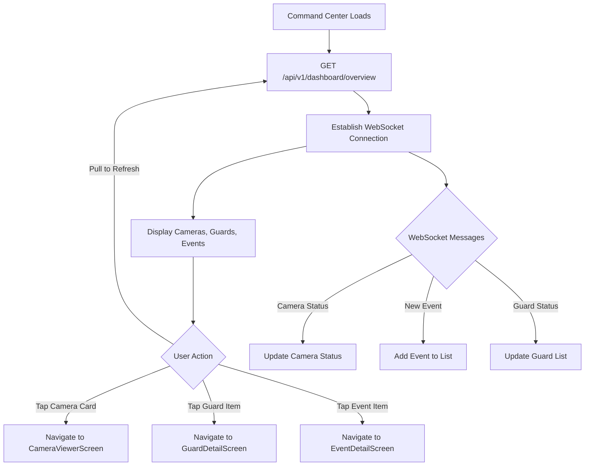

# Command Center Screen - API Documentation

## Screen Overview
**File**: `lib/screens/command_center/command_center_screen.dart`
**Purpose**: Main dashboard showing cameras, active guards, and recent events
**Tab**: First tab in AppShell bottom navigation
**Design**: Camera-first Apple Home style layout

## Screen Components

### Header Section
- Title: "Command Center"
- Subtitle: "X/X Cameras • X on duty" (dynamic counts)

### Cameras Grid
- 2-column grid of camera cards
- Each card shows:
  - Live video preview (HLS stream thumbnail)
  - Camera name (e.g., "Main Entrance")
  - Location/Space name (e.g., "Hospital A")
  - Status badge ("LIVE" with pulsing dot or "OFFLINE")
  - Tap → Navigate to CameraViewerScreen

### On Duty Section
- List of active AI Guards
- Each guard item shows:
  - Guard type icon (packages, people, vehicles, etc.)
  - Guard name
  - Guard type label
  - Weekly catches count
  - Tap → Navigate to GuardDetailScreen

### Latest Catches Section
- Recent events detected by guards (max 5)
- Each event shows:
  - Event icon with play circle
  - Event title (e.g., "Package Delivered")
  - Guard name that detected it
  - Location & relative time
  - Tap → Navigate to EventDetailScreen

---

## API Requirements

### 1. Get Dashboard Overview
**Endpoint**: `GET /api/v1/dashboard/overview`
**Timing**: Called on screen mount and on pull-to-refresh
**Purpose**: Fetch all data for Command Center in a single call

#### Request
```http
GET /api/v1/dashboard/overview
Headers:
  Authorization: Bearer <access_token>
```

#### Response - Success (200)
```json
{
  "success": true,
  "data": {
    "summary": {
      "totalCameras": 6,
      "onlineCameras": 5,
      "offlineCameras": 1,
      "activeGuards": 3,
      "totalGuards": 5,
      "eventsToday": 12,
      "lastUpdated": "2025-12-30T10:30:00Z"
    },
    "cameras": [
      {
        "id": "cam_abc123",
        "name": "Main Entrance",
        "location": "Hospital A",
        "spaceId": "space_xyz789",
        "spaceName": "Hospital A",
        "status": "online",
        "isRecording": true,
        "thumbnailUrl": "https://cdn.orin.app/thumbnails/cam_abc123_latest.jpg",
        "streamUrl": "https://stream.orin.app/live/cam_abc123/index.m3u8",
        "resolution": "1080p",
        "fps": 30,
        "lastSeen": "2025-12-30T10:29:55Z",
        "assignedGuards": ["grd_001", "grd_002"]
      },
      {
        "id": "cam_def456",
        "name": "Parking Lot",
        "location": "Hospital A",
        "spaceId": "space_xyz789",
        "spaceName": "Hospital A",
        "status": "offline",
        "isRecording": false,
        "thumbnailUrl": null,
        "streamUrl": null,
        "resolution": null,
        "fps": null,
        "lastSeen": "2025-12-29T18:45:00Z",
        "assignedGuards": []
      }
    ],
    "activeGuards": [
      {
        "id": "grd_001",
        "name": "Package Guard",
        "type": "packages",
        "description": "Alert me when packages are delivered",
        "isActive": true,
        "catchesThisWeek": 8,
        "lastDetectionAt": "2025-12-30T09:15:00Z",
        "cameraIds": ["cam_abc123"],
        "cameraNames": ["Main Entrance"],
        "sensitivity": 0.8,
        "notifyOnDetection": true
      },
      {
        "id": "grd_002",
        "name": "Visitor Monitor",
        "type": "people",
        "description": "Monitor visitors at entrance",
        "isActive": true,
        "catchesThisWeek": 15,
        "lastDetectionAt": "2025-12-30T10:20:00Z",
        "cameraIds": ["cam_abc123", "cam_ghi789"],
        "cameraNames": ["Main Entrance", "Lobby"],
        "sensitivity": 0.7,
        "notifyOnDetection": true
      }
    ],
    "recentEvents": [
      {
        "id": "evt_001",
        "guardId": "grd_001",
        "guardName": "Package Guard",
        "cameraId": "cam_abc123",
        "cameraName": "Main Entrance",
        "spaceId": "space_xyz789",
        "spaceName": "Hospital A",
        "type": "delivery",
        "title": "Package Delivered",
        "description": "A package was delivered to the main entrance",
        "timestamp": "2025-12-30T09:15:00Z",
        "thumbnailUrl": "https://cdn.orin.app/events/evt_001_thumb.jpg",
        "videoClipUrl": "https://cdn.orin.app/events/evt_001_clip.mp4",
        "confidence": 0.95,
        "isSaved": false,
        "isRead": true
      },
      {
        "id": "evt_002",
        "guardId": "grd_002",
        "guardName": "Visitor Monitor",
        "cameraId": "cam_abc123",
        "cameraName": "Main Entrance",
        "spaceId": "space_xyz789",
        "spaceName": "Hospital A",
        "type": "person",
        "title": "Person Detected",
        "description": "Person detected at entrance",
        "timestamp": "2025-12-30T10:20:00Z",
        "thumbnailUrl": "https://cdn.orin.app/events/evt_002_thumb.jpg",
        "videoClipUrl": "https://cdn.orin.app/events/evt_002_clip.mp4",
        "confidence": 0.88,
        "isSaved": false,
        "isRead": false
      }
    ]
  }
}
```

---

### 2. Get Live Camera Thumbnails
**Endpoint**: `GET /api/v1/cameras/{cameraId}/thumbnail`
**Timing**: Called for each camera to get latest snapshot
**Purpose**: Display live thumbnail in camera grid

#### Request
```http
GET /api/v1/cameras/cam_abc123/thumbnail?size=medium&timestamp=latest
Headers:
  Authorization: Bearer <access_token>
```

#### Query Parameters
- `size`: `small` | `medium` | `large` (default: medium)
- `timestamp`: `latest` | Unix timestamp (default: latest)

#### Response - Success (200)
```json
{
  "success": true,
  "data": {
    "cameraId": "cam_abc123",
    "thumbnailUrl": "https://cdn.orin.app/thumbnails/cam_abc123_latest.jpg",
    "capturedAt": "2025-12-30T10:29:55Z",
    "expiresAt": "2025-12-30T10:34:55Z"
  }
}
```

---

### 3. Get Camera Status
**Endpoint**: `GET /api/v1/cameras/status`
**Timing**: WebSocket or polling every 30 seconds
**Purpose**: Real-time camera status updates

#### Request
```http
GET /api/v1/cameras/status
Headers:
  Authorization: Bearer <access_token>
```

#### Response - Success (200)
```json
{
  "success": true,
  "data": {
    "cameras": [
      {
        "cameraId": "cam_abc123",
        "status": "online",
        "lastSeen": "2025-12-30T10:29:55Z",
        "isRecording": true
      },
      {
        "cameraId": "cam_def456",
        "status": "offline",
        "lastSeen": "2025-12-29T18:45:00Z",
        "isRecording": false
      }
    ],
    "timestamp": "2025-12-30T10:30:00Z"
  }
}
```

---

### 4. Get Active Guards Summary
**Endpoint**: `GET /api/v1/guards/active`
**Timing**: Called on screen mount (or included in dashboard overview)
**Purpose**: Fetch list of active guards with statistics

#### Request
```http
GET /api/v1/guards/active
Headers:
  Authorization: Bearer <access_token>
```

#### Response - Success (200)
```json
{
  "success": true,
  "data": {
    "activeGuards": [
      {
        "id": "grd_001",
        "name": "Package Guard",
        "type": "packages",
        "catchesThisWeek": 8,
        "lastDetectionAt": "2025-12-30T09:15:00Z",
        "cameraCount": 1,
        "isActive": true
      }
    ],
    "totalActive": 3
  }
}
```

---

### 5. Get Recent Events
**Endpoint**: `GET /api/v1/events/recent`
**Timing**: Called on screen mount or pull-to-refresh
**Purpose**: Fetch latest events for "Latest Catches" section

#### Request
```http
GET /api/v1/events/recent?limit=5&includeRead=true
Headers:
  Authorization: Bearer <access_token>
```

#### Query Parameters
- `limit`: Number of events to return (default: 5, max: 20)
- `includeRead`: Include already-read events (default: true)

#### Response - Success (200)
```json
{
  "success": true,
  "data": {
    "events": [
      {
        "id": "evt_001",
        "guardId": "grd_001",
        "guardName": "Package Guard",
        "cameraId": "cam_abc123",
        "cameraName": "Main Entrance",
        "spaceName": "Hospital A",
        "type": "delivery",
        "title": "Package Delivered",
        "timestamp": "2025-12-30T09:15:00Z",
        "thumbnailUrl": "https://cdn.orin.app/events/evt_001_thumb.jpg",
        "isRead": true,
        "isSaved": false
      }
    ],
    "totalUnread": 3,
    "lastUpdated": "2025-12-30T10:30:00Z"
  }
}
```

---

### 6. Mark Event as Read
**Endpoint**: `POST /api/v1/events/{eventId}/mark-read`
**Timing**: Called when user views event details
**Purpose**: Mark event as read to update unread count

#### Request
```http
POST /api/v1/events/evt_001/mark-read
Headers:
  Authorization: Bearer <access_token>
```

#### Response - Success (200)
```json
{
  "success": true,
  "data": {
    "eventId": "evt_001",
    "isRead": true,
    "readAt": "2025-12-30T10:30:00Z"
  }
}
```

---

### 7. WebSocket Connection for Real-Time Updates
**Endpoint**: `wss://api.orin.app/v1/ws/dashboard`
**Timing**: Establish on screen mount, close on dispose
**Purpose**: Real-time camera status, events, and guard updates

#### Connection
```javascript
WebSocket URL: wss://api.orin.app/v1/ws/dashboard
Headers:
  Authorization: Bearer <access_token>
  User-Id: usr_abc123xyz
```

#### Message Types

**1. Camera Status Update**
```json
{
  "type": "camera_status",
  "timestamp": "2025-12-30T10:30:00Z",
  "data": {
    "cameraId": "cam_abc123",
    "status": "online",
    "lastSeen": "2025-12-30T10:29:55Z"
  }
}
```

**2. New Event Detected**
```json
{
  "type": "event_detected",
  "timestamp": "2025-12-30T10:30:00Z",
  "data": {
    "eventId": "evt_003",
    "guardId": "grd_001",
    "guardName": "Package Guard",
    "cameraId": "cam_abc123",
    "cameraName": "Main Entrance",
    "type": "delivery",
    "title": "Package Delivered",
    "thumbnailUrl": "https://cdn.orin.app/events/evt_003_thumb.jpg"
  }
}
```

**3. Guard Status Changed**
```json
{
  "type": "guard_status_changed",
  "timestamp": "2025-12-30T10:30:00Z",
  "data": {
    "guardId": "grd_001",
    "isActive": false,
    "changedBy": "usr_abc123xyz"
  }
}
```

**4. Heartbeat/Ping**
```json
{
  "type": "ping",
  "timestamp": "2025-12-30T10:30:00Z"
}
```

**Client Response to Ping**
```json
{
  "type": "pong",
  "timestamp": "2025-12-30T10:30:00Z"
}
```

---

## Navigation Logic Flow



---

## Local Caching Strategy

### Data to Cache
1. **Dashboard Overview** - Cache for 5 minutes
2. **Camera Thumbnails** - Cache for 30 seconds
3. **Camera Status** - Real-time (no cache)
4. **Active Guards** - Cache for 2 minutes
5. **Recent Events** - Cache for 1 minute

### Cache Keys (Hive/SharedPreferences)
```dart
const String CACHE_DASHBOARD_OVERVIEW = 'cache_dashboard_overview';
const String CACHE_DASHBOARD_TIMESTAMP = 'cache_dashboard_timestamp';
const String CACHE_CAMERA_THUMBNAILS = 'cache_camera_thumbnails';
```

---

## Error Handling

### Network Errors
- **No Internet**: Show cached data with offline indicator
- **Timeout**: Retry once, then show error with refresh button
- **Server Error (5xx)**: Show error message with retry option

### WebSocket Errors
- **Connection Failed**: Fall back to polling (30-second intervals)
- **Connection Lost**: Auto-reconnect with exponential backoff
- **Auth Error**: Refresh token and reconnect

### Empty States
- **No Cameras**: Show "Add your first camera" empty state
- **No Guards**: Show "Create your first guard" empty state
- **No Events**: Show "No events yet" empty state

---

## Performance Optimizations

1. **Single API Call**: Use dashboard overview endpoint to fetch all data
2. **WebSocket**: Use WebSocket for real-time updates instead of polling
3. **Lazy Loading**: Load camera thumbnails only when visible
4. **Image Caching**: Cache camera thumbnails with expiry
5. **Debounce Refresh**: Prevent multiple rapid refresh attempts
6. **Pagination**: Limit recent events to 5 for performance

---

## API Call Sequence

```
1. [0ms]     Screen Mounted
2. [100ms]   GET /api/v1/dashboard/overview
3. [150ms]   Establish WebSocket Connection
4. [800ms]   Dashboard data received
5. [850ms]   Render cameras, guards, events
6. [900ms]   Start lazy loading camera thumbnails
7. [ONGOING] WebSocket messages update UI in real-time
8. [REFRESH] User pulls to refresh → Repeat from step 2
```

---

## Analytics Events

```dart
// Event 1: Command Center Viewed
{
  "event": "command_center_viewed",
  "timestamp": "2025-12-30T10:30:00Z",
  "userId": "usr_abc123xyz",
  "cameraCount": 6,
  "activeGuardCount": 3,
  "unreadEventCount": 3
}

// Event 2: Camera Card Tapped
{
  "event": "camera_card_tapped",
  "cameraId": "cam_abc123",
  "cameraName": "Main Entrance",
  "timestamp": "2025-12-30T10:30:15Z"
}

// Event 3: Guard Item Tapped
{
  "event": "guard_item_tapped",
  "guardId": "grd_001",
  "guardName": "Package Guard",
  "timestamp": "2025-12-30T10:30:30Z"
}

// Event 4: Event Item Tapped
{
  "event": "event_item_tapped",
  "eventId": "evt_001",
  "eventType": "delivery",
  "timestamp": "2025-12-30T10:30:45Z"
}

// Event 5: Pull to Refresh
{
  "event": "dashboard_refreshed",
  "timestamp": "2025-12-30T10:31:00Z"
}
```

---

## Testing Scenarios

1. **Normal Load**: All cameras online → Show live grid
2. **Some Offline**: Mix of online/offline cameras → Show status correctly
3. **No Cameras**: Empty state → Show "Add camera" message
4. **No Guards**: Empty state → Show "Create guard" message
5. **No Events**: Empty state → Show "No events yet"
6. **Network Offline**: Show cached data with offline indicator
7. **WebSocket Failed**: Fall back to polling
8. **Pull to Refresh**: Reload all data
9. **Real-Time Update**: WebSocket message → Update UI
10. **Camera Goes Offline**: WebSocket message → Update status badge

---

## Security Considerations

1. **Authentication**: All API calls require valid Bearer token
2. **WebSocket Auth**: Token sent in headers on connection
3. **Rate Limiting**: Limit refresh attempts (max 1 per 5 seconds)
4. **Data Privacy**: Only show user's own cameras and guards
5. **Image Security**: Thumbnails should have signed URLs with expiry

---

## Dependencies

### Required Packages
- `http` or `dio` - HTTP client
- `web_socket_channel` - WebSocket connection
- `cached_network_image` - Image caching
- `pull_to_refresh` - Pull-to-refresh functionality
- `intl` - Date/time formatting
- `hive` or `shared_preferences` - Local caching

---

## Future Enhancements

1. **Filter Cameras**: Filter by space/location
2. **Search**: Search cameras by name
3. **Sort Options**: Sort cameras by name, status, or space
4. **Thumbnail Refresh**: Manual refresh button for camera thumbnails
5. **Grid Layout**: Switch between 2-column and 3-column grid
6. **Quick Actions**: Long-press camera card for quick actions
7. **Offline Mode**: Full offline support with local database sync

---

## Notes

- Command Center is the main hub of the application
- Real-time updates are critical for security monitoring
- WebSocket connection should auto-reconnect on failure
- Camera thumbnails should update every 30 seconds in background
- Unread event count should be visible on Events tab badge
- Consider implementing infinite scroll if event list grows
- Thumbnail URLs should be cached to reduce API calls
- Status badges should pulse/animate for "LIVE" cameras
