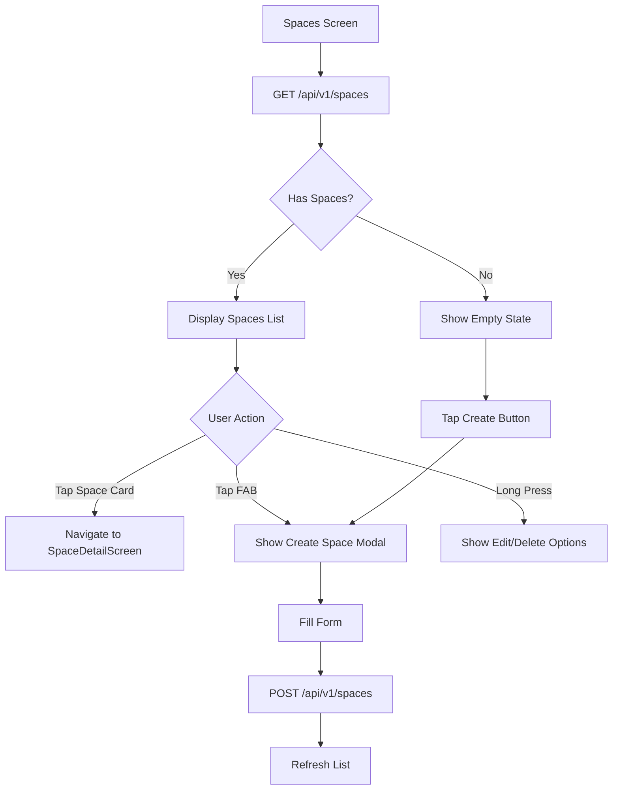

# Spaces Screen - API Documentation

## Screen Overview
**File**: `lib/screens/spaces/spaces_screen.dart`
**Purpose**: Organize cameras by physical locations/spaces (Hospital A, Office, Home, etc.)
**Tab**: Second tab in AppShell bottom navigation
**Design**: List view with space cards and camera counts

## Screen Components

### Header Section
- Title: "Spaces"
- Subtitle: "Organize your cameras by location"

### Spaces List
- List of all created spaces
- Each space card shows:
  - Space icon (hospital, business, home, apartment, store, city)
  - Space name (e.g., "Hospital A")
  - Camera count (e.g., "3 cameras")
  - Chevron for navigation
  - Tap → Navigate to SpaceDetailScreen

### Floating Action Button (FAB)
- Plus icon button
- Tap → Show create space modal bottom sheet

### Create Space Modal
- Modal bottom sheet with form:
  - Space name text input
  - Icon selector (6 types: hospital, business, home, apartment, store, city)
  - Create button

### Empty State
- Shown when no spaces exist
- Icon + message: "No spaces yet"
- Subtitle: "Create a space to organize your cameras"
- Create Space button

---

## API Requirements

### 1. Get All Spaces
**Endpoint**: `GET /api/v1/spaces`
**Timing**: Called on screen mount and pull-to-refresh
**Purpose**: Fetch all user's spaces with camera counts

#### Request
```http
GET /api/v1/spaces?includeCameras=true&includeStats=true
Headers:
  Authorization: Bearer <access_token>
```

#### Query Parameters
- `includeCameras`: Include camera details for each space (default: false)
- `includeStats`: Include statistics like camera count (default: true)
- `sort`: `name` | `created_at` | `camera_count` (default: name)
- `order`: `asc` | `desc` (default: asc)

#### Response - Success (200)
```json
{
  "success": true,
  "data": {
    "spaces": [
      {
        "id": "space_abc123",
        "name": "Hospital A",
        "icon": "hospital",
        "description": "Main hospital building",
        "cameraCount": 3,
        "onlineCameraCount": 3,
        "offlineCameraCount": 0,
        "createdAt": "2025-01-01T00:00:00Z",
        "updatedAt": "2025-12-30T10:00:00Z",
        "cameras": [
          {
            "id": "cam_001",
            "name": "Main Entrance",
            "status": "online"
          },
          {
            "id": "cam_002",
            "name": "Parking Lot",
            "status": "online"
          },
          {
            "id": "cam_003",
            "name": "Lobby",
            "status": "online"
          }
        ]
      },
      {
        "id": "space_def456",
        "name": "Hospital B",
        "icon": "hospital",
        "description": "Satellite location",
        "cameraCount": 2,
        "onlineCameraCount": 1,
        "offlineCameraCount": 1,
        "createdAt": "2025-01-15T00:00:00Z",
        "updatedAt": "2025-12-30T10:00:00Z",
        "cameras": [
          {
            "id": "cam_004",
            "name": "Entrance",
            "status": "online"
          },
          {
            "id": "cam_005",
            "name": "Emergency Exit",
            "status": "offline"
          }
        ]
      }
    ],
    "totalSpaces": 2,
    "totalCameras": 5,
    "unassignedCameras": 1
  }
}
```

---

### 2. Create New Space
**Endpoint**: `POST /api/v1/spaces`
**Timing**: Called when user submits create space form
**Purpose**: Create a new space for organizing cameras

#### Request
```http
POST /api/v1/spaces
Headers:
  Authorization: Bearer <access_token>
  Content-Type: application/json

Body:
{
  "name": "Office Building",
  "icon": "business",
  "description": "Main office location",
  "address": {
    "street": "123 Main St",
    "city": "New York",
    "state": "NY",
    "zipCode": "10001",
    "country": "USA"
  },
  "timezone": "America/New_York"
}
```

#### Response - Success (201)
```json
{
  "success": true,
  "data": {
    "space": {
      "id": "space_new789",
      "name": "Office Building",
      "icon": "business",
      "description": "Main office location",
      "cameraCount": 0,
      "onlineCameraCount": 0,
      "offlineCameraCount": 0,
      "createdAt": "2025-12-30T10:30:00Z",
      "updatedAt": "2025-12-30T10:30:00Z",
      "address": {
        "street": "123 Main St",
        "city": "New York",
        "state": "NY",
        "zipCode": "10001",
        "country": "USA"
      },
      "timezone": "America/New_York"
    }
  },
  "message": "Space created successfully"
}
```

#### Response - Validation Error (400)
```json
{
  "success": false,
  "error": {
    "code": "VALIDATION_ERROR",
    "message": "Please check your input and try again.",
    "validationErrors": [
      {
        "field": "name",
        "message": "Space name is required."
      },
      {
        "field": "icon",
        "message": "Icon must be one of: hospital, business, home, apartment, store, city."
      }
    ]
  }
}
```

#### Response - Duplicate Name (409)
```json
{
  "success": false,
  "error": {
    "code": "DUPLICATE_SPACE_NAME",
    "message": "A space with this name already exists.",
    "field": "name"
  }
}
```

---

### 3. Update Space
**Endpoint**: `PUT /api/v1/spaces/{spaceId}`
**Timing**: Called when user edits space details
**Purpose**: Update space information

#### Request
```http
PUT /api/v1/spaces/space_abc123
Headers:
  Authorization: Bearer <access_token>
  Content-Type: application/json

Body:
{
  "name": "Hospital A - Updated",
  "icon": "hospital",
  "description": "Updated description"
}
```

#### Response - Success (200)
```json
{
  "success": true,
  "data": {
    "space": {
      "id": "space_abc123",
      "name": "Hospital A - Updated",
      "icon": "hospital",
      "description": "Updated description",
      "cameraCount": 3,
      "updatedAt": "2025-12-30T10:35:00Z"
    }
  },
  "message": "Space updated successfully"
}
```

---

### 4. Delete Space
**Endpoint**: `DELETE /api/v1/spaces/{spaceId}`
**Timing**: Called when user deletes a space
**Purpose**: Remove a space (cameras become unassigned)

#### Request
```http
DELETE /api/v1/spaces/space_abc123
Headers:
  Authorization: Bearer <access_token>
```

#### Query Parameters
- `reassignCameras`: `true` | `false` - Whether to reassign cameras to another space (default: false)
- `targetSpaceId`: Space ID to reassign cameras to (required if reassignCameras=true)

#### Response - Success (200)
```json
{
  "success": true,
  "data": {
    "deletedSpaceId": "space_abc123",
    "camerasReassigned": 3,
    "targetSpaceId": "space_def456"
  },
  "message": "Space deleted successfully. 3 cameras were reassigned."
}
```

#### Response - Space Has Cameras (400)
```json
{
  "success": false,
  "error": {
    "code": "SPACE_HAS_CAMERAS",
    "message": "Cannot delete space with cameras. Please reassign or remove cameras first.",
    "meta": {
      "cameraCount": 3,
      "cameraIds": ["cam_001", "cam_002", "cam_003"]
    }
  }
}
```

---

### 5. Get Unassigned Cameras
**Endpoint**: `GET /api/v1/cameras/unassigned`
**Timing**: Called when showing option to assign cameras to space
**Purpose**: Fetch cameras not assigned to any space

#### Request
```http
GET /api/v1/cameras/unassigned
Headers:
  Authorization: Bearer <access_token>
```

#### Response - Success (200)
```json
{
  "success": true,
  "data": {
    "cameras": [
      {
        "id": "cam_unassigned001",
        "name": "Warehouse Camera",
        "status": "online",
        "addedAt": "2025-12-25T10:00:00Z"
      }
    ],
    "count": 1
  }
}
```

---

### 6. Assign Cameras to Space
**Endpoint**: `POST /api/v1/spaces/{spaceId}/cameras`
**Timing**: Called when user assigns cameras to a space
**Purpose**: Add multiple cameras to a space

#### Request
```http
POST /api/v1/spaces/space_abc123/cameras
Headers:
  Authorization: Bearer <access_token>
  Content-Type: application/json

Body:
{
  "cameraIds": ["cam_001", "cam_002", "cam_003"]
}
```

#### Response - Success (200)
```json
{
  "success": true,
  "data": {
    "spaceId": "space_abc123",
    "camerasAdded": 3,
    "cameraIds": ["cam_001", "cam_002", "cam_003"]
  },
  "message": "3 cameras added to space successfully"
}
```

---

### 7. Remove Camera from Space
**Endpoint**: `DELETE /api/v1/spaces/{spaceId}/cameras/{cameraId}`
**Timing**: Called when user removes a camera from space
**Purpose**: Unassign camera from space

#### Request
```http
DELETE /api/v1/spaces/space_abc123/cameras/cam_001
Headers:
  Authorization: Bearer <access_token>
```

#### Response - Success (200)
```json
{
  "success": true,
  "data": {
    "spaceId": "space_abc123",
    "cameraId": "cam_001",
    "removedAt": "2025-12-30T10:40:00Z"
  },
  "message": "Camera removed from space successfully"
}
```

---

## Navigation Logic Flow



---

## Local Storage Requirements

### Data to Cache
1. **Spaces List** - Cache for 5 minutes
2. **Last Refresh Timestamp** - Track cache validity
3. **Spaces Count** - Quick access for UI

### Cache Keys (Hive/SharedPreferences)
```dart
const String CACHE_SPACES_LIST = 'cache_spaces_list';
const String CACHE_SPACES_TIMESTAMP = 'cache_spaces_timestamp';
const String CACHE_SPACES_COUNT = 'cache_spaces_count';
```

---

## Error Handling

### Network Errors
- **No Internet**: Show cached data with offline indicator
- **Timeout**: Retry once, then show error with refresh button
- **Server Error (5xx)**: Show error message with retry option

### Validation Errors
- **Empty Name**: Show inline error "Space name is required"
- **Invalid Icon**: Show error "Please select a valid icon"
- **Duplicate Name**: Show error "A space with this name already exists"

### Empty States
- **No Spaces**: Show "Create your first space" empty state
- **No Cameras in Space**: Show "Add cameras to this space" message

---

## Performance Optimizations

1. **Single API Call**: Fetch all spaces with stats in one call
2. **Lazy Loading**: Load space details only when needed
3. **Image Caching**: Cache space icons locally
4. **Debounce Create**: Prevent double-submit on create button
5. **Optimistic UI**: Show space immediately, sync in background

---

## API Call Sequence

```
1. [0ms]     Screen Mounted
2. [100ms]   GET /api/v1/spaces?includeCameras=true&includeStats=true
3. [800ms]   Spaces data received
4. [850ms]   Render spaces list
5. [USER]    Tap FAB → Show create modal
6. [USER]    Submit form
7. [+100ms]  POST /api/v1/spaces
8. [+600ms]  Space created
9. [+650ms]  Refresh list → GET /api/v1/spaces
```

---

## Client-Side Validation

### Space Name Validation
```dart
bool isValidSpaceName(String name) {
  return name.trim().isNotEmpty && name.length <= 50;
}
```

### Icon Validation
```dart
const List<String> VALID_ICONS = [
  'hospital', 'business', 'home', 'apartment', 'store', 'city'
];

bool isValidIcon(String icon) {
  return VALID_ICONS.contains(icon);
}
```

---

## Analytics Events

```dart
// Event 1: Spaces Screen Viewed
{
  "event": "spaces_screen_viewed",
  "timestamp": "2025-12-30T10:30:00Z",
  "userId": "usr_abc123xyz",
  "spaceCount": 2
}

// Event 2: Space Created
{
  "event": "space_created",
  "spaceId": "space_new789",
  "spaceName": "Office Building",
  "icon": "business",
  "timestamp": "2025-12-30T10:30:30Z"
}

// Event 3: Space Tapped
{
  "event": "space_tapped",
  "spaceId": "space_abc123",
  "spaceName": "Hospital A",
  "cameraCount": 3,
  "timestamp": "2025-12-30T10:31:00Z"
}

// Event 4: Space Deleted
{
  "event": "space_deleted",
  "spaceId": "space_abc123",
  "hadCameras": true,
  "cameraCount": 3,
  "timestamp": "2025-12-30T10:32:00Z"
}
```

---

## Testing Scenarios

1. **Normal Load**: Show spaces list
2. **Empty State**: No spaces → Show create prompt
3. **Create Space**: Fill form → Create successfully
4. **Duplicate Name**: Create with existing name → Show error
5. **Delete Space**: Delete space with cameras → Show warning
6. **Offline Mode**: Show cached spaces with indicator
7. **Pull to Refresh**: Reload spaces list
8. **Long Press**: Show edit/delete menu
9. **Invalid Icon**: Submit with invalid icon → Show error

---

## Security Considerations

1. **Authorization**: Users can only see/modify their own spaces
2. **Input Validation**: Sanitize space names on backend
3. **Rate Limiting**: Limit space creation (max 10 per hour)
4. **Soft Delete**: Implement soft delete for recovery

---

## UI/UX Notes

- **Icon Display**: Use consistent icon sizes (24x24dp)
- **Card Spacing**: 16dp between cards
- **Modal Animation**: Slide up from bottom (300ms)
- **Success Feedback**: Show snackbar "Space created successfully"
- **Confirmation Dialog**: Ask before deleting space with cameras
- **Pull to Refresh**: Standard Material pull-to-refresh
- **Loading State**: Show shimmer while loading

---

## Dependencies

### Required Packages
- `http` or `dio` - HTTP client
- `hive` or `sqflite` - Local caching
- `pull_to_refresh` - Pull-to-refresh functionality
- `flutter_slidable` - Swipe actions for edit/delete
- `cupertino_icons` - iOS-style icons

---

## Future Enhancements

1. **Space Templates**: Pre-configured spaces (Hospital, Office, Home)
2. **Space Sharing**: Share spaces with other users
3. **Geofencing**: Auto-assign cameras based on location
4. **Space Analytics**: Statistics for each space
5. **Bulk Actions**: Select multiple spaces for bulk operations
6. **Search Spaces**: Search bar for finding spaces
7. **Sort Options**: Sort by name, camera count, or date created
8. **Space Tags**: Add tags/labels to spaces

---

## Notes

- Spaces are containers for organizing cameras by physical location
- A camera can only belong to one space at a time
- Deleting a space doesn't delete cameras (they become unassigned)
- Space icons help with quick visual identification
- Consider limiting max spaces per user (e.g., 50) for performance
- Space list should support reordering via drag-and-drop (future)
