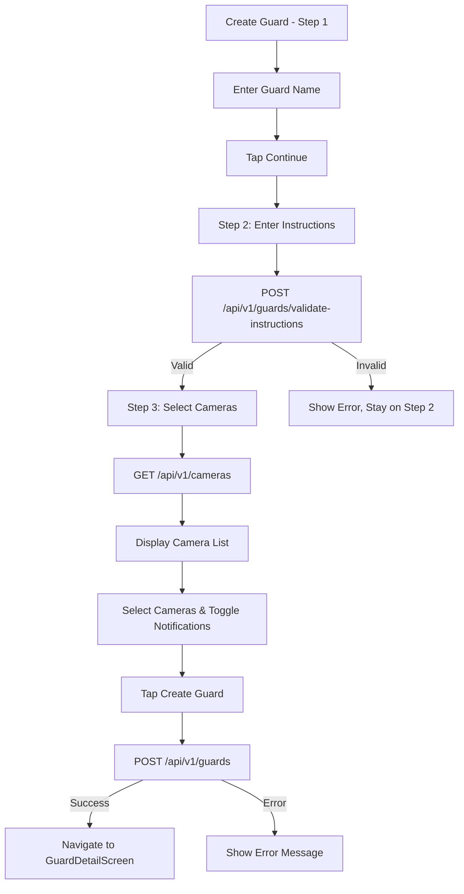

# Create Guard Screen - API Documentation

## Screen Overview
**File**: `lib/screens/guards/create_guard_screen.dart`
**Purpose**: 3-step wizard to create a new AI security guard
**Navigation**: From Guards Screen FAB or Empty State
**Design**: Step-by-step form with progress indicator

## Screen Flow

### Step 1: Name Your Guard
- Text input for guard name
- Placeholder: "Front Door Guard"
- Info tip: "Think of guards as members of your security team"
- Continue button

### Step 2: Guard Instructions
- Multi-line text area for natural language instructions
- Examples shown:
  - "Alert me when a package is delivered to the front door"
  - "Watch for people near the pool after 10pm"
  - "Let me know if any vehicle enters the driveway"
- Info tip: "Be specific about what, when, and where"
- Continue button

### Step 3: Select Cameras
- Checkbox list of available cameras
- Select multiple cameras
- Toggle for notifications
- Create Guard button

### Progress Indicator
- Shows current step (1/3, 2/3, 3/3)
- Back button to previous step

---

## API Requirements

### 1. Get Available Cameras for Guard
**Endpoint**: `GET /api/v1/cameras?available=true`
**Timing**: Called on Step 3 mount
**Purpose**: Fetch cameras that can be assigned to guard

#### Request
```http
GET /api/v1/cameras?available=true&includeSpaces=true
Headers:
  Authorization: Bearer <access_token>
```

#### Response - Success (200)
```json
{
  "success": true,
  "data": {
    "cameras": [
      {
        "id": "cam_001",
        "name": "Main Entrance",
        "spaceId": "space_abc123",
        "spaceName": "Hospital A",
        "status": "online",
        "resolution": "1080p",
        "assignedGuardsCount": 2
      },
      {
        "id": "cam_002",
        "name": "Parking Lot",
        "spaceId": "space_abc123",
        "spaceName": "Hospital A",
        "status": "online",
        "resolution": "1080p",
        "assignedGuardsCount": 0
      }
    ],
    "totalCameras": 6
  }
}
```

---

### 2. Validate Guard Instructions (AI Processing)
**Endpoint**: `POST /api/v1/guards/validate-instructions`
**Timing**: Called on Step 2 when user clicks Continue
**Purpose**: Validate and extract intent from natural language instructions

#### Request
```http
POST /api/v1/guards/validate-instructions
Headers:
  Authorization: Bearer <access_token>
  Content-Type: application/json

Body:
{
  "instructions": "Alert me when a package is delivered to the front door"
}
```

#### Response - Success (200)
```json
{
  "success": true,
  "data": {
    "isValid": true,
    "extractedIntent": {
      "primaryType": "packages",
      "detectionTarget": "package",
      "location": "front door",
      "timeConstraint": null,
      "actionVerb": "alert",
      "confidence": 0.95
    },
    "suggestedGuardType": "packages",
    "suggestedSensitivity": 0.8,
    "suggestions": [
      "Consider specifying time constraints (e.g., 'during business hours')",
      "You can also specify package types (e.g., 'large packages only')"
    ]
  }
}
```

#### Response - Invalid/Unclear Instructions (400)
```json
{
  "success": false,
  "error": {
    "code": "UNCLEAR_INSTRUCTIONS",
    "message": "Instructions are not clear enough. Please be more specific about what you want the guard to monitor.",
    "suggestions": [
      "Specify what to detect (people, packages, vehicles, etc.)",
      "Mention the location or area to monitor",
      "Include any time constraints if needed"
    ]
  }
}
```

---

### 3. Create Guard
**Endpoint**: `POST /api/v1/guards`
**Timing**: Called on Step 3 when user clicks "Create Guard"
**Purpose**: Create new AI guard with all configuration

#### Request
```http
POST /api/v1/guards
Headers:
  Authorization: Bearer <access_token>
  Content-Type: application/json

Body:
{
  "name": "Front Door Guard",
  "description": "Alert me when a package is delivered to the front door",
  "type": "packages",
  "cameraIds": ["cam_001", "cam_002"],
  "sensitivity": 0.8,
  "notifyOnDetection": true,
  "detectionConfig": {
    "primaryType": "packages",
    "detectionTarget": "package",
    "location": "front door",
    "timeConstraints": null,
    "minimumConfidence": 0.7
  }
}
```

#### Response - Success (201)
```json
{
  "success": true,
  "data": {
    "guard": {
      "id": "grd_new123",
      "name": "Front Door Guard",
      "description": "Alert me when a package is delivered to the front door",
      "type": "packages",
      "isActive": true,
      "sensitivity": 0.8,
      "catchesThisWeek": 0,
      "totalCatches": 0,
      "lastDetectionAt": null,
      "createdAt": "2025-12-30T11:00:00Z",
      "updatedAt": "2025-12-30T11:00:00Z",
      "notifyOnDetection": true,
      "cameraIds": ["cam_001", "cam_002"],
      "cameraCount": 2,
      "successRate": null
    }
  },
  "message": "Guard created successfully and is now active"
}
```

#### Response - Validation Error (400)
```json
{
  "success": false,
  "error": {
    "code": "VALIDATION_ERROR",
    "message": "Please check your input and try again.",
    "validationErrors": [
      {
        "field": "name",
        "message": "Guard name is required."
      },
      {
        "field": "cameraIds",
        "message": "Please select at least one camera."
      }
    ]
  }
}
```

#### Response - Guard Limit Reached (403)
```json
{
  "success": false,
  "error": {
    "code": "GUARD_LIMIT_REACHED",
    "message": "You've reached the maximum number of guards for your plan.",
    "meta": {
      "currentPlan": "free",
      "maxGuards": 5,
      "currentGuardCount": 5,
      "upgradeUrl": "https://orin.app/upgrade"
    }
  }
}
```

---

### 4. Get Guard Type Recommendations
**Endpoint**: `POST /api/v1/guards/recommend-type`
**Timing**: Called in background on Step 2 (optional)
**Purpose**: AI-powered guard type recommendation

#### Request
```http
POST /api/v1/guards/recommend-type
Headers:
  Authorization: Bearer <access_token>
  Content-Type: application/json

Body:
{
  "instructions": "Watch for people near the pool after 10pm",
  "cameraIds": ["cam_003"]
}
```

#### Response - Success (200)
```json
{
  "success": true,
  "data": {
    "recommendedType": "people",
    "confidence": 0.92,
    "reasoning": "Detected intent to monitor 'people' with time constraint 'after 10pm'",
    "alternativeTypes": [
      {
        "type": "motion",
        "confidence": 0.65,
        "reasoning": "Could also use general motion detection"
      }
    ],
    "suggestedSensitivity": 0.75
  }
}
```

---

## Navigation Logic Flow



---

## Client-Side Validation

### Step 1: Name Validation
```dart
bool isValidGuardName(String name) {
  return name.trim().isNotEmpty && name.length >= 3 && name.length <= 50;
}
```

### Step 2: Instructions Validation
```dart
bool isValidInstructions(String instructions) {
  return instructions.trim().isNotEmpty && instructions.length >= 10;
}
```

### Step 3: Camera Selection Validation
```dart
bool hasSelectedCameras(List<String> cameraIds) {
  return cameraIds.isNotEmpty;
}
```

---

## Local Storage Requirements

### Draft Guard State
Store incomplete guard creation for recovery:
```dart
const String DRAFT_GUARD_NAME = 'draft_guard_name';
const String DRAFT_GUARD_INSTRUCTIONS = 'draft_guard_instructions';
const String DRAFT_GUARD_CAMERAS = 'draft_guard_cameras';
```

---

## Error Handling

### Network Errors
- **No Internet**: Disable Continue/Create buttons, show offline message
- **Timeout**: Retry validation/creation once
- **Server Error**: Show error with retry option

### Validation Errors
- **Empty Name**: "Guard name is required"
- **Short Instructions**: "Please provide more detailed instructions (min 10 characters)"
- **No Cameras Selected**: "Please select at least one camera"
- **Invalid Instructions**: Show AI feedback with suggestions

---

## Analytics Events

```dart
// Guard Creation Started
{
  "event": "guard_creation_started",
  "timestamp": "2025-12-30T11:00:00Z",
  "userId": "usr_abc123xyz"
}

// Step Completed
{
  "event": "guard_creation_step_completed",
  "step": 1,
  "stepName": "name",
  "timestamp": "2025-12-30T11:00:30Z"
}

// Instructions Validated
{
  "event": "guard_instructions_validated",
  "isValid": true,
  "suggestedType": "packages",
  "confidence": 0.95,
  "timestamp": "2025-12-30T11:01:00Z"
}

// Guard Created
{
  "event": "guard_created",
  "guardId": "grd_new123",
  "guardType": "packages",
  "cameraCount": 2,
  "notificationsEnabled": true,
  "totalSteps": 3,
  "totalDuration": 90,
  "timestamp": "2025-12-30T11:01:30Z"
}

// Guard Creation Abandoned
{
  "event": "guard_creation_abandoned",
  "abandonedAtStep": 2,
  "timestamp": "2025-12-30T11:00:45Z"
}
```

---

## Testing Scenarios

1. **Complete Flow**: Go through all 3 steps → Success
2. **Invalid Name**: Submit empty name → Show error
3. **Unclear Instructions**: Vague instructions → Show AI feedback
4. **No Cameras**: Don't select cameras → Show error
5. **Network Offline**: Try to validate/create → Show offline error
6. **Guard Limit**: Create when at limit → Show upgrade message
7. **Back Navigation**: Go back through steps → Preserve data
8. **Draft Recovery**: Close and reopen → Restore draft

---

## UI/UX Notes

- **Progress Indicator**: Clear visual indicator of current step
- **Back Button**: Allow going back to edit previous steps
- **Examples**: Show helpful examples on instruction step
- **Auto-Save Draft**: Save progress locally every 5 seconds
- **Confirmation**: Show success message with guard name
- **Smart Suggestions**: Display AI suggestions for improvement

---

## Dependencies

- `http` or `dio` - HTTP client
- `shared_preferences` - Draft storage
- `flutter_markdown` - Display instruction examples

---

## Notes

- AI validation helps ensure high-quality guard instructions
- Guard creation is async - show loading indicator
- Consider implementing guard templates for common use cases
- Save draft to allow users to resume if interrupted
- Validate instructions on backend to prevent abuse
- Sensitivity can be adjusted later in edit screen
