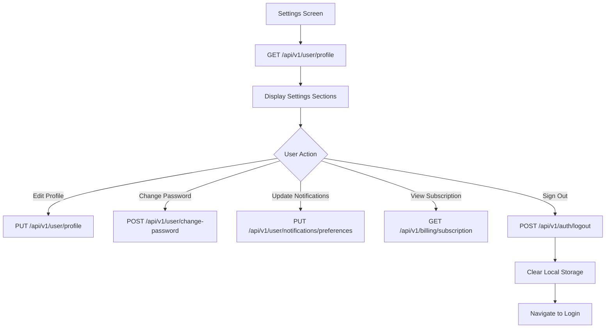

# Settings Screen - API Documentation

## Screen Overview
**File**: `lib/screens/settings/settings_screen.dart`
**Purpose**: User account settings, app preferences, and system configuration
**Tab**: Fifth tab in AppShell bottom navigation
**Design**: iOS-style grouped list with sections

## Screen Components

### Sections

#### ACCOUNT
- **Profile** → Edit profile screen (name, email, photo)
- **Password & Security** → Change password, 2FA, sessions

#### NOTIFICATIONS
- **Alert Preferences** → Configure guard notifications
- **Quiet Hours** → Set do-not-disturb schedule

#### DEVICES
- **Manage Cameras** → Add/remove/configure cameras
- **Network Settings** → Wi-Fi, cellular data usage

#### BILLING
- **Payment Method** → Credit card management
- **Subscription** → Plan details, upgrade/downgrade

#### SYSTEM
- **System Health** → App diagnostics, storage usage
- **Storage** → Manage local/cloud storage
- **About** → App version, terms, privacy

#### Sign Out Button

---

## API Requirements

### 1. Get User Profile
**Endpoint**: `GET /api/v1/user/profile`
**Timing**: Called on screen mount
**Purpose**: Fetch current user information

#### Request
```http
GET /api/v1/user/profile
Headers:
  Authorization: Bearer <access_token>
```

#### Response - Success (200)
```json
{
  "success": true,
  "data": {
    "user": {
      "id": "usr_abc123xyz",
      "email": "user@example.com",
      "firstName": "John",
      "lastName": "Doe",
      "fullName": "John Doe",
      "profilePictureUrl": "https://cdn.orin.app/avatars/usr_abc123xyz.jpg",
      "phoneNumber": "+1234567890",
      "phoneVerified": true,
      "emailVerified": true,
      "role": "owner",
      "createdAt": "2025-01-01T00:00:00Z",
      "lastLoginAt": "2025-12-30T10:00:00Z"
    }
  }
}
```

---

### 2. Update User Profile
**Endpoint**: `PUT /api/v1/user/profile`
**Timing**: Called when user updates profile
**Purpose**: Update user information

#### Request
```http
PUT /api/v1/user/profile
Headers:
  Authorization: Bearer <access_token>
  Content-Type: application/json

Body:
{
  "firstName": "John",
  "lastName": "Doe",
  "phoneNumber": "+1234567890"
}
```

#### Response - Success (200)
```json
{
  "success": true,
  "data": {
    "user": {
      "id": "usr_abc123xyz",
      "firstName": "John",
      "lastName": "Doe",
      "updatedAt": "2025-12-30T12:00:00Z"
    }
  },
  "message": "Profile updated successfully"
}
```

---

### 3. Change Password
**Endpoint**: `POST /api/v1/user/change-password`
**Timing**: Called from password settings
**Purpose**: Update user password

#### Request
```http
POST /api/v1/user/change-password
Headers:
  Authorization: Bearer <access_token>
  Content-Type: application/json

Body:
{
  "currentPassword": "OldPassword123!",
  "newPassword": "NewPassword456!",
  "confirmPassword": "NewPassword456!"
}
```

#### Response - Success (200)
```json
{
  "success": true,
  "message": "Password changed successfully"
}
```

---

### 4. Get Notification Preferences
**Endpoint**: `GET /api/v1/user/notifications/preferences`
**Timing**: Called when viewing notification settings
**Purpose**: Fetch notification configuration

#### Request
```http
GET /api/v1/user/notifications/preferences
Headers:
  Authorization: Bearer <access_token>
```

#### Response - Success (200)
```json
{
  "success": true,
  "data": {
    "preferences": {
      "pushEnabled": true,
      "emailEnabled": true,
      "smsEnabled": false,
      "eventTypes": {
        "delivery": true,
        "person": true,
        "vehicle": true,
        "motion": false
      },
      "quietHours": {
        "enabled": true,
        "startTime": "22:00",
        "endTime": "07:00",
        "timezone": "America/New_York"
      },
      "notificationSound": "default",
      "vibration": true
    }
  }
}
```

---

### 5. Update Notification Preferences
**Endpoint**: `PUT /api/v1/user/notifications/preferences`
**Timing**: Called when user changes settings
**Purpose**: Update notification configuration

#### Request
```http
PUT /api/v1/user/notifications/preferences
Headers:
  Authorization: Bearer <access_token>
  Content-Type: application/json

Body:
{
  "pushEnabled": true,
  "emailEnabled": false,
  "quietHours": {
    "enabled": true,
    "startTime": "23:00",
    "endTime": "06:00"
  }
}
```

#### Response - Success (200)
```json
{
  "success": true,
  "message": "Notification preferences updated"
}
```

---

### 6. Get Subscription Details
**Endpoint**: `GET /api/v1/billing/subscription`
**Timing**: Called when viewing subscription
**Purpose**: Fetch current subscription plan

#### Request
```http
GET /api/v1/billing/subscription
Headers:
  Authorization: Bearer <access_token>
```

#### Response - Success (200)
```json
{
  "success": true,
  "data": {
    "subscription": {
      "id": "sub_abc123",
      "plan": "premium",
      "status": "active",
      "billingCycle": "monthly",
      "amount": 29.99,
      "currency": "USD",
      "nextBillingDate": "2026-01-30T00:00:00Z",
      "cancelAtPeriodEnd": false,
      "features": {
        "maxCameras": 20,
        "maxGuards": 50,
        "storageGB": 500,
        "aiSummaries": true,
        "prioritySupport": true
      }
    }
  }
}
```

---

### 7. Get Active Sessions
**Endpoint**: `GET /api/v1/user/sessions`
**Timing**: Called in security settings
**Purpose**: View active login sessions

#### Request
```http
GET /api/v1/user/sessions
Headers:
  Authorization: Bearer <access_token>
```

#### Response - Success (200)
```json
{
  "success": true,
  "data": {
    "sessions": [
      {
        "id": "sess_001",
        "deviceName": "iPhone 15 Pro",
        "platform": "ios",
        "ipAddress": "192.168.1.100",
        "location": "New York, NY",
        "isCurrent": true,
        "lastActiveAt": "2025-12-30T12:00:00Z",
        "createdAt": "2025-12-30T10:00:00Z"
      },
      {
        "id": "sess_002",
        "deviceName": "MacBook Pro",
        "platform": "web",
        "ipAddress": "192.168.1.105",
        "location": "New York, NY",
        "isCurrent": false,
        "lastActiveAt": "2025-12-29T18:00:00Z",
        "createdAt": "2025-12-25T09:00:00Z"
      }
    ]
  }
}
```

---

### 8. Revoke Session
**Endpoint**: `DELETE /api/v1/user/sessions/{sessionId}`
**Timing**: Called when user revokes session
**Purpose**: Log out from specific device

#### Request
```http
DELETE /api/v1/user/sessions/sess_002
Headers:
  Authorization: Bearer <access_token>
```

#### Response - Success (200)
```json
{
  "success": true,
  "message": "Session revoked successfully"
}
```

---

### 9. Sign Out
**Endpoint**: `POST /api/v1/auth/logout`
**Timing**: Called when user signs out
**Purpose**: Invalidate current session

#### Request
```http
POST /api/v1/auth/logout
Headers:
  Authorization: Bearer <access_token>
```

#### Response - Success (200)
```json
{
  "success": true,
  "message": "Signed out successfully"
}
```

---

### 10. Get System Health
**Endpoint**: `GET /api/v1/system/health`
**Timing**: Called in system settings
**Purpose**: Check app and camera system status

#### Request
```http
GET /api/v1/system/health
Headers:
  Authorization: Bearer <access_token>
```

#### Response - Success (200)
```json
{
  "success": true,
  "data": {
    "appHealth": {
      "status": "healthy",
      "version": "1.0.0",
      "uptime": "720h"
    },
    "cameraSystem": {
      "totalCameras": 6,
      "onlineCameras": 5,
      "offlineCameras": 1,
      "averageUptime": "98.5%"
    },
    "storage": {
      "used": "156.5 GB",
      "available": "343.5 GB",
      "total": "500 GB",
      "usagePercentage": 31.3
    },
    "guards": {
      "totalGuards": 5,
      "activeGuards": 3,
      "totalCatchesThisMonth": 195
    }
  }
}
```

---

## Navigation Logic Flow



---

## Analytics Events

```dart
// Settings Viewed
{
  "event": "settings_viewed",
  "timestamp": "2025-12-30T12:00:00Z"
}

// Profile Updated
{
  "event": "profile_updated",
  "fieldsChanged": ["firstName", "phoneNumber"],
  "timestamp": "2025-12-30T12:05:00Z"
}

// Password Changed
{
  "event": "password_changed",
  "timestamp": "2025-12-30T12:10:00Z"
}

// Signed Out
{
  "event": "user_signed_out",
  "timestamp": "2025-12-30T12:15:00Z"
}
```

---

## Local Storage Cleanup on Sign Out

```dart
// Clear all local data
await secureStorage.deleteAll();
await sharedPreferences.clear();
await hive.deleteBoxFromDisk();
```

---

## Notes

- Settings screen follows iOS design patterns
- All changes should show confirmation feedback
- Password change requires current password for security
- Sign out clears all local data and tokens
- Consider adding dark mode toggle in future
- Support for biometric authentication (Face ID/Touch ID)
